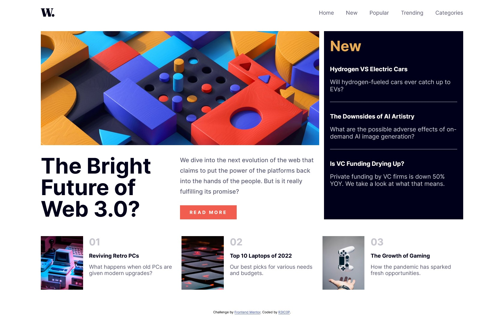
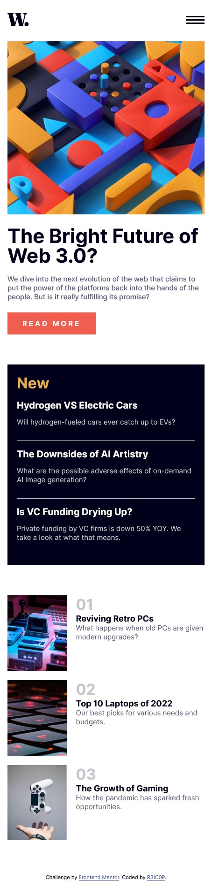

# Frontend Mentor - News homepage solution

This is a solution to the [News homepage challenge on Frontend Mentor](https://www.frontendmentor.io/challenges/news-homepage-H6SWTa1MFl). Frontend Mentor challenges help you improve your coding skills by building realistic projects.

## Table of contents

-   [Overview](#overview)
    -   [The challenge](#the-challenge)
    -   [Screenshot](#screenshot)
    -   [Links](#links)
-   [My process](#my-process)
    -   [Built with](#built-with)
    -   [Useful resources](#useful-resources)
-   [Author](#author)

## Overview

### The challenge

Users should be able to:

-   View the optimal layout for the interface depending on their device's screen size
-   See hover and focus states for all interactive elements on the page

### Screenshot

-   DESKTOP

-   MOBILE

### Links

-   Solution URL: [GitHub Repository](https://github.com/R3IC0P/FM-news-homepage)
-   Live Site URL: [Live Preview](https://r3ic0p.github.io/FM-news-homepage/)

## My process

### Built with

-   Semantic HTML5 markup
-   CSS custom properties
-   Flexbox
-   CSS Grid
-   Mobile-first workflow

### Useful resources

-   [Flexbox](https://css-tricks.com/snippets/css/a-guide-to-flexbox/)
-   [Grid](https://css-tricks.com/snippets/css/complete-guide-grid/)

Helpful cheat sheets ;)

## Author

-   Frontend Mentor - [@R3IC0P](https://www.frontendmentor.io/profile/R3IC0P)
